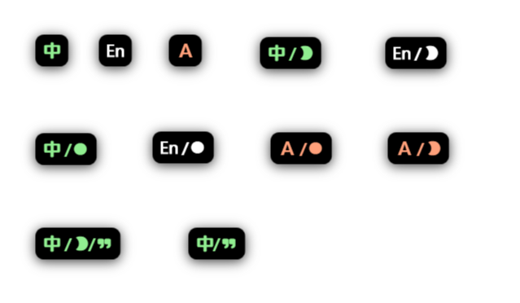

<h1 align="center">LangIndicator</h1>

## Installation

Download the latest [Release](https://github.com/ZGGSONG/LangIndicator/releases) version and extract it to use.

## Images

## Author

**LangIndicator** © [zggsong](https://github.com/zggsong), Released under the [MIT](https://github.com/ZGGSONG/LangIndicator/blob/main/LICENSE) License. 

> Website [Blog](https://www.zggsong.com) · GitHub [@zggsong](https://github.com/zggsong)
